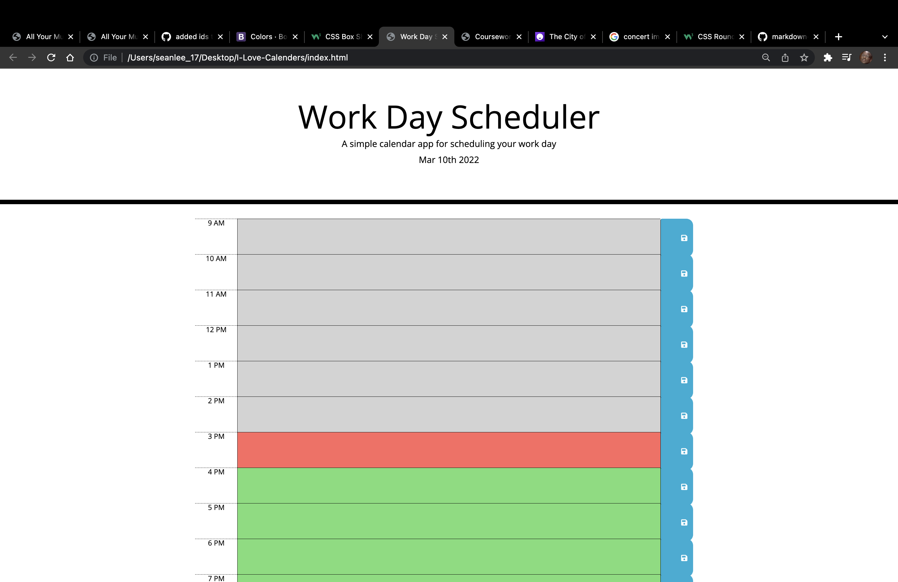

# I-Love-Calenders

In this webpage I was able to create several functions and implement various third-party API's in order to create a daily calender website. Through the use of HTML, CSS, and JavaScript, I was able to color code elements from Bootstrap, jQuery, Google Fonts, and Moment.js in a way that the user can plan events for the past, present, and future. I also implemented the use of local storage in order to save the user's plans onto the webpage. I hope that this webpage is easier to use that it was to code.

# Languages and Third Party API's

- HTML
- CSS
- JavaScript
- Bootstrap
- jQuery
- Google Fonts
- Moment.js
- FontAwesome

# Links

- https://seanlee-17.github.io/I-Love-Calenders/
- https://github.com/SeanLee-17/I-Love-Calenders

# Screenshot

